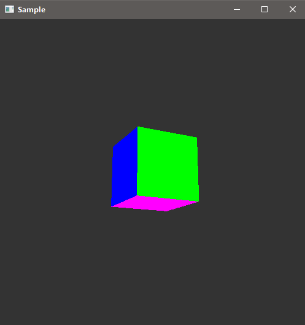

<!-- TOC -->

- [Draw Cube](#draw-cube)
    - [Waiting for a Swapchain Buffer](#waiting-for-a-swapchain-buffer)
    - [Beginning the Render Pass](#beginning-the-render-pass)
    - [Bind the Pipeline](#bind-the-pipeline)
    - [Bind the Descriptor Sets](#bind-the-descriptor-sets)
    - [Bind the Vertex Buffer](#bind-the-vertex-buffer)
    - [Set the Viewport and Scissors Rectangle](#set-the-viewport-and-scissors-rectangle)
    - [Draw the Vertices](#draw-the-vertices)
    - [Transitioning the Swapchain Image for Presenting](#transitioning-the-swapchain-image-for-presenting)
        - [Memory barrier approach](#memory-barrier-approach)
    - [Submit the Command Buffer](#submit-the-command-buffer)
    - [Wait for Command Buffer to Complete](#wait-for-command-buffer-to-complete)
    - [Present the Swapchain Buffer to Display](#present-the-swapchain-buffer-to-display)

<!-- /TOC -->

## Draw Cube

本章节代码在`15-draw_cube.cpp`文件中。

我们已经完成绝大部分工作了，这里是我们需要做的最后一步，将Vlukan图像画到屏幕上。

### Waiting for a Swapchain Buffer

开始画图之前，样例程序需要渲染一个目标swapchain图像作为底色。用函数`vkAcquireNextImageKHR()`获取swapchain列表的一个索引，这样就能知道用哪一个framebuffer作为渲染目标。这也是下一个可用于渲染的图像。
```
res = vkCreateSemaphore(info.device, &imageAcquiredSemaphoreCreateInfo,
                        NULL, &imageAcquiredSemaphore);

// Get the index of the next available swapchain image:
res = vkAcquireNextImageKHR(info.device, info.swap_chain, UINT64_MAX,
                            imageAcquiredSemaphore, VK_NULL_HANDLE,
                            &info.current_buffer);
```
第一帧，可能不需要使用信号（semaphore），因为swapchain中的所有图像都可用。在随后要正要提交的GPU命令之前，确保图像可用仍然是好的实现方案。如果图像采样在多帧中都有所改变，比如动画，那就很有必要等待硬件完成图像渲染，以便再次使用该图像的swapchain。

注意，本样例不需要等待其他东西的完成。我们仅仅创建信号，并且将它和图像联系起来，以便用这个信号推迟命令缓存的提交，直到图像准备好进行渲染。

### Beginning the Render Pass

在以前的章节，我们已经定义了渲染通道，所以在命令缓存中，我们可以直接通过设置一个开启渲染通道的命令来启用渲染通道：
```
VkRenderPassBeginInfo rp_begin;
rp_begin.sType = VK_STRUCTURE_TYPE_RENDER_PASS_BEGIN_INFO;
rp_begin.pNext = NULL;
rp_begin.renderPass = info.render_pass;
rp_begin.framebuffer = info.framebuffers[info.current_buffer];
rp_begin.renderArea.offset.x = 0;
rp_begin.renderArea.offset.y = 0;
rp_begin.renderArea.extent.width = info.width;
rp_begin.renderArea.extent.height = info.height;
rp_begin.clearValueCount = 2;
rp_begin.pClearValues = clear_values;
vkCmdBeginRenderPass(info.cmd, &rp_begin, VK_SUBPASS_CONTENTS_INLINE);
```
在上面这段代码中:

注意，我们已经创建了一个命令缓存，并且，在本样例前面的地方通过调用`init_command_buffer()`和`execute_begin_command()`将命令缓冲区设置成了记录模式(recording mode)。

我们提供了之前定义的渲染通道和用`vkAcquireNextImageKHR()`返回的索引选择的framebuffer。

clear值来作为初始化值是用来设置背景颜色为深灰色，并且深度缓存的clear值设为深度缓存的“far”(`clear_values`)值。

`info.render_pass`中剩下的需要的信息在以前已经设置好，然后我们只需要直接将它们插入到命令缓存，开始渲染通道。

### Bind the Pipeline

下一步绑定管线到命令缓存：
```
vkCmdBindPipeline(info.cmd, VK_PIPELINE_BIND_POINT_GRAPHICS, info.pipeline);
```
在前面章节中我们定义了管线并绑定，而在这里绑定它到`info.cmd`，告诉GPU怎样渲染后面的图元（graphics primitives）。

`VK_PIPELINE_BIND_POINT_GRAPHICS`告诉GPU这是图形管线，而不是计算管线。

注意，这个指令是一个命令缓存指令，而在单个命令缓存中，程序可能定义许多图形管线，并且在他们之间转换。

### Bind the Descriptor Sets

我们已经定义的描述符集描述了着色程序怎样期望发现它的输入数据，例如MVP变换。这里是给GPU的信息：
```
vkCmdBindDescriptorSets(info.cmd, VK_PIPELINE_BIND_POINT_GRAPHICS,
                        info.pipeline_layout, 0, 1,
                        info.desc_set.data(), 0, NULL);
```
注意，在命令缓存中，如果我们想要改变着色器程序怎样找到数据，我们可以绑定不同的描述符。例如，我们想要在命令缓存中间改变转换，我们可以用一个不同的描述符来指向一个不同的MVP转换。

### Bind the Vertex Buffer

我们在vertex_buffer样例中创建一个vertex buffer，并用顶点数据填充。这里，告诉GPU怎样找到它：
```
vkCmdBindDescriptorSets(info.cmd, VK_PIPELINE_BIND_POINT_GRAPHICS,
                        info.pipeline_layout, 0, 1,
                        info.desc_set.data(), 0, NULL);
```
这个命令绑定顶点缓存（vertex buffer）或缓存区（buffers）到命令缓存。我们只能绑定一个缓存，但是，可以用它来绑定多次。

### Set the Viewport and Scissors Rectangle

前面我们指明视口（viewport）和剪切（scissors）是动态的状态，意味着可以用命令缓存指令（a command buffer command）设置它们。所以，我们在这里需要设置它们。下面是`init_viewports()`中设置视区的代码：
```
info.viewport.height = (float)info.height;
info.viewport.width = (float)info.width;
info.viewport.minDepth = (float)0.0f;
info.viewport.maxDepth = (float)1.0f;
info.viewport.x = 0;
info.viewport.y = 0;
vkCmdSetViewport(info.cmd, 0, NUM_VIEWPORTS, &info.viewport);
```
设置剪切矩形（scissors rectangle）的代码类似。

由于许多应用程序可能在运行时改变窗口的大小，所以使上面的`viewport`为动态(dynamic)的变量最合适。当窗口大小改变时，这样就避免了重建管线的做法。

### Draw the Vertices

最后，给GPU发送一个绘制命令，将顶点送到管线中完成渲染通道。
```
vkCmdDraw(info.cmd, 12 * 3, 1, 0, 0);
vkCmdEndRenderPass(info.cmd);
```
其中，`vkCmdDraw`命令告诉GPU绘制一次36个顶点的图形。现在你已经设置好了画一系列独立的三角形的管线的最初部分，即GPU会绘制12个三角形。

 `vkCmdEndRenderPass`命令表示渲染通道的结束，但是命令缓冲区仍然“开着(open)”并且样例也没有结束命令的发送。

### Transitioning the Swapchain Image for Presenting

当GPU进行渲染时，目标交换链(swapchain)的图像布局格式是`VK_IMAGE_LAYOUT_COLOR_ATTACHMENT_OPTIMAL`，是一种最适合GPU渲染的布局格式。在之前的章节中，我们定义渲染通道时，将这个布局格式设置到了子通道的定义中。但这种布局格式对于显示硬件扫描的图像输出到显示设备来说并不是最好的布局格式。比如，用于渲染的优化的GPU内存布局是平铺的("tiled")，如同之前在渲染通道章节所讲的那样。但显示硬件会为输出选择线性内存布局。使用`VK_IMAGE_LAYOUT_PRESENT_SRC_KHR`布局可以指定将要被显示的图像。

在渲染通道章节中，你已经了解过布局转换，在这里我们通过指定在颜色图像附件(color image attachment)定义中的属性`finalLayout`为`VK_IMAGE_LAYOUT_PRESENT_SRC_KHR`来转换格式：
```
VkAttachmentDescription attachments[2];
attachments[0].format = info.format;
attachments[0].samples = NUM_SAMPLES;
attachments[0].loadOp = VK_ATTACHMENT_LOAD_OP_CLEAR;
attachments[0].storeOp = VK_ATTACHMENT_STORE_OP_STORE;
attachments[0].stencilLoadOp = VK_ATTACHMENT_LOAD_OP_DONT_CARE;
attachments[0].stencilStoreOp = VK_ATTACHMENT_STORE_OP_DONT_CARE;
attachments[0].initialLayout = VK_IMAGE_LAYOUT_UNDEFINED;
attachments[0].finalLayout = VK_IMAGE_LAYOUT_PRESENT_SRC_KHR;
attachments[0].flags = 0;
```

#### Memory barrier approach

注意，内存屏障(Memory Barrier)方法是另外一种用于完成布局转换的方法，该方法是通过发送另外一个内存屏障命令到内存缓冲中。这种替代方法在某些情况下是有用的，比如那些没有使用渲染通道的命令提交。我们可以在`copy_blit_image`中找到一个适用场景。虽然在本样例中并没有用到，但在统一文件夹下的其他样例中可以看到。

在本样例中，我们使用了一个渲染通道，但如果我们设置颜色附件的`finalLayout`属性值为渲染通道样例中的创建的渲染通道的`initialLayout`属性的值，那我们仍然可以使用内存屏障方法：
```
attachments[0].initialLayout = VK_IMAGE_LAYOUT_COLOR_ATTACHMENT_OPTIMAL;
attachments[0].finalLayout = VK_IMAGE_LAYOUT_COLOR_ATTACHMENT_OPTIMAL;
```
这就需要我们使用另外一个管线内存平常来完成布局转换，方法与`set_image_layout()`完成布局转换的过程有很多相类似的地方：
```
VkImageMemoryBarrier prePresentBarrier = {};
prePresentBarrier.sType = VK_STRUCTURE_TYPE_IMAGE_MEMORY_BARRIER;
prePresentBarrier.pNext = NULL;
prePresentBarrier.srcAccessMask = VK_ACCESS_COLOR_ATTACHMENT_WRITE_BIT;
prePresentBarrier.dstAccessMask = VK_ACCESS_MEMORY_READ_BIT;
prePresentBarrier.oldLayout = VK_IMAGE_LAYOUT_COLOR_ATTACHMENT_OPTIMAL;
prePresentBarrier.newLayout = VK_IMAGE_LAYOUT_PRESENT_SRC_KHR;
prePresentBarrier.srcQueueFamilyIndex = VK_QUEUE_FAMILY_IGNORED;
prePresentBarrier.dstQueueFamilyIndex = VK_QUEUE_FAMILY_IGNORED;
prePresentBarrier.subresourceRange.aspectMask = VK_IMAGE_ASPECT_COLOR_BIT;
prePresentBarrier.subresourceRange.baseMipLevel = 0;
prePresentBarrier.subresourceRange.levelCount = 1;
prePresentBarrier.subresourceRange.baseArrayLayer = 0;
prePresentBarrier.subresourceRange.layerCount = 1;
prePresentBarrier.image = info.buffers[info.current_buffer].image;
vkCmdPipelineBarrier(info.cmd, VK_PIPELINE_STAGE_ALL_COMMANDS_BIT,
                     VK_PIPELINE_STAGE_BOTTOM_OF_PIPE_BIT, 0, 0, NULL, 0,
                     NULL, 1, &prePresentBarrier);
```
上面的代码并没有在本样例中出现，但可以在`copy_blit_image`样例中找到。

一旦该命令在渲染通道结束后执行，那图像缓冲就做好了显示的准备了。当然，对于深度缓冲图像布局格式并不需要进行转换。

### Submit the Command Buffer

要时刻明确，现在还没有发送给GPU任何一条命令(都在命令缓冲区中)。现在使用下面的调用，表示完成命令记录：
```
res = vkEndCommandBuffer(info.cmd);
```
我们需要创建一个监视围栏(fence)用于报告GPU何时完成任务。我们需要指定GPU何时完成任务，这样才能避免太早开始下一次呈现显示：
```
VkFenceCreateInfo fenceInfo;
VkFence drawFence;
fenceInfo.sType = VK_STRUCTURE_TYPE_FENCE_CREATE_INFO;
fenceInfo.pNext = NULL;
fenceInfo.flags = 0;
vkCreateFence(info.device, &fenceInfo, NULL, &drawFence);
```
现在，我们可以提交命令缓冲区了：
```
const VkCommandBuffer cmd_bufs[] = {info.cmd};
VkPipelineStageFlags pipe_stage_flags =
    VK_PIPELINE_STAGE_BOTTOM_OF_PIPE_BIT;
VkSubmitInfo submit_info[1] = {};
submit_info[0].pNext = NULL;
submit_info[0].sType = VK_STRUCTURE_TYPE_SUBMIT_INFO;
submit_info[0].waitSemaphoreCount = 1;
submit_info[0].pWaitSemaphores = &imageAcquiredSemaphore;
submit_info[0].pWaitDstStageMask = &pipe_stage_flags;
submit_info[0].commandBufferCount = 1;
submit_info[0].pCommandBuffers = cmd_bufs;
submit_info[0].signalSemaphoreCount = 0;
submit_info[0].pSignalSemaphores = NULL;
res = vkQueueSubmit(info.queue, 1, submit_info, drawFence);
```
`VK_PIPELINE_STAGE_BOTTOM_OF_PIPE_BIT`表示该命令在管线最后阶段完成执行。

`imageAcquiredSemaphore`是图像绘制之前完成准备的等待信号，如本章节前面所讲。它让驱动得知何时交换链图像是可用的。然后再将命令提交到GPU。当GPU执行完命令时，GPU会给围栏`drawFence`发送绘制完成的信号。

### Wait for Command Buffer to Complete

`vkWaitForFences()`用于等待命令缓冲区中命令执行完成。当命令会花很长时间才能完成，该函数应当在一个循环中去调用它。但本样例中比较简单，并没有使用这种做法。
```
do {
    res = vkWaitForFences(info.device, 1, &drawFence, VK_TRUE, FENCE_TIMEOUT);
} while (res == VK_TIMEOUT);
```
此时，我们就知道了交换链图像缓冲区已经做好了显示的准备。

### Present the Swapchain Buffer to Display

接下来就可以直接将交换链图像显示出来：
```
VkPresentInfoKHR present;
present.sType = VK_STRUCTURE_TYPE_PRESENT_INFO_KHR;
present.pNext = NULL;
present.swapchainCount = 1;
present.pSwapchains = &info.swap_chain;
present.pImageIndices = &info.current_buffer;
present.pWaitSemaphores = NULL;
present.waitSemaphoreCount = 0;
present.pResults = NULL;
res = vkQueuePresentKHR(info.queue, &present);
```
现在，我们可以看到显示器出现一个画有立方体的窗口了。



---

本篇**Vulkan Samples Tutorial**原文是**LUNAEXCHANGE**中的[Vulkan Tutorial](https://vulkan.lunarg.com/doc/sdk/1.0.42.1/windows/tutorial/html/index.html)的译文。
并非逐字逐句翻译，如有错误之处请告知。O(∩_∩)O谢谢~~


