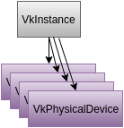

<!-- TOC -->

- [Introduction](#introduction)
- [Instance](#instance)
    - [Vulkan Instance](#vulkan-instance)
    - [vkCreateInstance](#vkcreateinstance)
    - [VkInstanceCreateInfo](#vkinstancecreateinfo)
    - [VkApplicationInfo](#vkapplicationinfo)
    - [Back to the Code](#back-to-the-code)
- [Enumerate Devices](#enumerate-devices)
    - [vkEnumeratePhysicalDevices](#vkenumeratephysicaldevices)
    - [The Samples_info Structure](#the-samples_info-structure)
- [Device](#device)
    - [Device Queues and Queue Families](#device-queues-and-queue-families)
- [Command Buffer](#command-buffer)
- [Swapchain](#swapchain)
- [Depth Buffer](#depth-buffer)
- [Uniform Buffer](#uniform-buffer)
- [Pipeline Layout](#pipeline-layout)
- [Descriptor Set](#descriptor-set)
- [Render Pass](#render-pass)
- [Shaders](#shaders)
- [Framebuffers](#framebuffers)
- [Vertex Buffer](#vertex-buffer)
- [Pipeline](#pipeline)
- [Draw Cube](#draw-cube)

<!-- /TOC -->

本文会通过几个章节告诉你们如何一步一步地创建一个简单的Vulkan程序，每一章节对应着Vulkan程序运行的每一部分过程。

相关代码在下载的Vulkan SDK中的**Samples**文件夹中，在使用cmake构建工程之前，请先阅读**Documentation/vulkan_samples.html**文件来了解如何构建时所需要的配置。在此不再赘述。

本文的最终目标是初步理解Vulkan API的使用并创建出显示一个立方体的程序，效果如下：


---

## Introduction

每个章节的代码使用下面的格式，目的是为了能够使大家能够了解该章节的主题。
```
init_instance(info, sample_title);
init_enumerate_device(info);
init_window_size(info, 500, 500);
init_connection(info);
init_window(info);
init_swapchain_extension(info);
init_device(info);
...
/* VULKAN_KEY_START */

... code of interest

/* VULKAN_KEY_END */
...
destroy_device(info);
destroy_window(info);
destroy_instance(info);
```
---

## Instance

本章节的代码在`01-init_instance.cpp`文件中。

### Vulkan Instance

Vulkan API使用`vkInstance`来存储程序的预先设置的状态(`per-application state`)，所有的应用程序在使用Vulkan API进行操作之前都必须需要创建**Vulkan Instance**。

Vulkan程序的基础结构如下：


上图告诉我们：Vulkan程序会被连接到一个Vulkan库上，这个库被称为**Loader**。应用程序需要通过创建Vulkan Instance来对loader进行初始化。loader之后会对更底层的显卡驱动进行加载和初始化。

> 上图中，有许多**Layers**被loader加载，这些Layer通常被用作程序校验的，例如对程序的正常运行进行错误检查。在Vulkan中，设备驱动程序变得比在使用OpenGL时更加轻量级化，这是因为在OpenGL中的一些如校验功能等被Layers所代替。Layers是可配置的，也可以在每次创建程序时选择加载。Vulkan Layers不再本文的讨论范围之内。进一步了解请到LunarXchange的Layers章节进行了解和学习。

### vkCreateInstance

在`01-init_instance.cpp`文件中，我们找到下面这一句：
```
res = vkCreateInstance(&inst_info, NULL, &inst);
```
`vkCreateInstance`函数的原型如下：
```
VKAPI_ATTR VkResult VKAPI_CALL vkCreateInstance(
    const VkInstanceCreateInfo*                 pCreateInfo,
    const VkAllocationCallbacks*                pAllocator,
    VkInstance*                                 pInstance);
```
在`vulkan.h`头文件中查看该函数定义，我们可以得知：
+ `vkResult`是一个枚举类型，查看其定义可知，它定义了一系列vulkan的状态，如：`VK_SUCCESS`，`VK_NOT_READY`，`VK_TIMEOUT`,`VK_EVENT_SET` ，`VK_EVENT_RESET`，`VK_INCOMPLETE`等。我们可以通过该返回值来判断我们进行的vulkan操作是否得到我们需要的状态，并针对该状态进行处理。
+ `VkInstanceCreateInfo`是一个结构体类型，查看其定义可知，该结构体中用来存储创建Vulkan Instance所必须的一些设置。
+ `VkAllocationCallbacks`也是一个结构体类型，但通过查看其定义，它其中存放的是一些**函数指针**(不支持lambda表达式，但我们可以使用`std::function::target`函数获取lambda表达式的函数指针，具体用法可以参照[cppreference.com - target](http://en.cppreference.com/w/cpp/utility/functional/function/target)的使用方法)，这些函数作为回调函数供`vkCreateinstance`函数使用。该函数用于实现应用程序自己的内存分配策略，如果没有设置，则vulkan会执行其默认的内存分配策略。在本小节的`01-init_instance.cpp`文件中并没有使用该特性，因此调用位置设置的值为`NULL`。
+ `VkInstance`是一个Vulkan Instance类型，该参数是一个返回值，当Vulkan Instance创建成功后该返回值有值。由于该实例并不是一个我们可见的自定义类型，当使用它时不应当去尝试对它**解除引用(de-reference)**。

> 注意：`vkCreateInstance`函数为我们展示了许多Vulkan函数的定义方法，返回值为操作完成的状态，参数中有输入的设置变量，数据变量，也有输出的实例。

### VkInstanceCreateInfo

接下来我们查看一下`VkInstanceCreateInfo`类型的定义：
```
typedef struct VkInstanceCreateInfo {
    VkStructureType             sType;
    const void*                 pNext;
    VkInstanceCreateFlags       flags;
    const VkApplicationInfo*    pApplicationInfo;
    uint32_t                    enabledLayerCount;
    const char* const*          ppEnabledLayerNames;
    uint32_t                    enabledExtensionCount;
    const char* const*          ppEnabledExtensionNames;
} VkInstanceCreateInfo;
```
该结构体的前两个属性，会在许多Vulkan `CreateInfo`中进行定义。
+ `sType`是一个枚举类型，表明当前`CreateInfo`是个什么类型的结构体，虽然看似与`VkInstanceCreateInfo`的命名作用重合，在`CreateInfo`结构体声明自己的类型有两个原因：
    - 驱动程序(driver)，校验插件(validation layer)或者其他定义的结构可以方便地进行类型检验，如果不符合期望类型则会停止执行下面的操作。
    - 该结构体可以被一个无类型指针(void *)传递到一个使用未定义类型指针的函数中，在该函数中进行类型转换后可以方便进行类型检验。比如，一个驱动程序支持一个扩展来创建vulkan实例，该驱动程序就会沿着`pNext`指向的`CreateInfo`链表查找指定类型的结构体，以满足插件的需要。
+ `pNext`是一个无类型指针，它有时候会被用于指向一些记录着特定信息的结构体，这些结构体是某些插件所需要的。该值可能会很少被用到。
+ `flags`这是一个标记变量(……不知是干什么的)。
+ `pApplicationInfo`变量存放的是`VkApplicationInfo`类型结构体的指针，该类型会在下面讲到。
+ `enabledLayerCount`加载的插件(layer)的数量，如果没有加载，则设置为0即可。
+ `ppEnabledLayerNames`加载的插件的名称的数组的指针，就是将插件列表的首地址设置到这个结构体中。
+ `enabledExtensionCount`使用的扩展(extension)的数量，如果没有使用，则设置为0即可。
+ `ppEnabledExtensionNames`同样，这里是将扩展的列表的首地址设置到这个结构体中。

### VkApplicationInfo

接下来我们看看用于提供Vulkan程序基本信息的`VkApplicationInfo`类型的定义：
```
typedef struct VkApplicationInfo {
    VkStructureType    sType;
    const void*        pNext;
    const char*        pApplicationName;
    uint32_t           applicationVersion;
    const char*        pEngineName;
    uint32_t           engineVersion;
    uint32_t           apiVersion;
} VkApplicationInfo;
```
+ `sType`和`pNext`同上面的`VkInstanceCreateInfo`中的作用相同，记录该结构体的类型以及构成结构体链。
+ `pApplicationName`, `applicationVersion`, `pEngineName`, `engineVersion`这四个属性值是可以进行自由设置，有一些工具，加载器，插件和驱动程序(tools, loaders, layers, or drivers)会通过这几个变量提供一些Debug信息或者其他报告信息，程序运行时，驱动程序可以根据这些设置进行区别化地运行。
+ `apiVersion`设置Vulkan API的版本号，暂且设置为`VK_API_VERSION_1_0`就好。

### Back to the Code

在`/* VULKAN_KEY_START */`和`/* VULKAN_KEY_END */`之间的代码，做了下面几件事情：
+ 初始化`VkApplicationInfo`结构体`app_info`和`VkInstanceCreateInfo`结构体`inst_info`；
+ 使用`vkCreateInstance()`函数创建Vulkan Instance，即`inst`；
+ 对`VkResult`类型的返回值`res`变量进行检查，如果发现创建失败则终止程序；
+ 使用`vkDestroyInstance()`对`inst`进行释放。

---

## Enumerate Devices

本章节的代码在`02-enumerate_devices.cpp`中。

 在你创建Vulkan Instance之后，Loader就会知道有多少个物理显示设备可用，而你的应用程序则需要调用Vulkan API来获取设备列表。在获取设备可用数量之后，便可以进行区别化的逻辑运算。

 Vulkan Instance依赖着vkPhysicalDevice(不明白这里的这个图想具体告诉我们什么)：


 ### Getting Lists of Objects from Vulkan

 获取对象列表在Vulkan操作中是非常常见的行为，Vulkan API对这种需求的策略也是一致的：返回值为**对象数量**和**对象列表指针首地址**。在使用获取对象列表的API
 时，我们需要按照下面的步骤进行：
 + 调用获取对象列表的API，传入的参数为一个整数型变量的地址和NULL指针，前者用于第一次获取对象列表的对象数量，后者告诉API本次不获取对象列表。
 + API会将对象列表的数量填到传入的整形变量地址所指向的整形变量上。
 + 应用程序需要根据API给出的对象列表数量申请足够多的内存。
 + 应用程序再次调用获取对象列表的API，传入的参数为一个整数型变量的地址，和上一步申请内存的地址，这一次API会将对象列表存储到传入的指针所指向的位置上。
该方法是使用获取对象列表API的标准流程。

### vkEnumeratePhysicalDevices

`vkEnumeratePhysicalDevices`函数，就是用来获取显示设备列表的API，在`02-enumerate_devices.cpp`文件中，我们可以看到如下使用方法：
```
uint32_t gpu_count = 1;
// Get the number of devices (GPUs) available.
VkResult U_ASSERT_ONLY res = vkEnumeratePhysicalDevices(info.inst, &gpu_count, NULL);
assert(gpu_count);
// Allocate space and get the list of devices.
info.gpus.resize(gpu_count);
res = vkEnumeratePhysicalDevices(info.inst, &gpu_count, info.gpus.data());
assert(!res && gpu_count >= 1);
```
在这里的使用方法，如上面步骤一样。
> 注意：`info.gpus` 变量的声明为 `std::vector<VkPhysicalDevice> gpus`，是一个`VkPhysicalDevice`类型的vector数组。

### The Samples_info Structure

在文件`02-enumerate_devices.cpp`中，我们看到这样的：
```
struct sample_info info = {};
init_global_layer_properties(info);
init_instance(info, "vulkansamples_enumerate");
```
在这里，所有的样例源代码文件中，会声明`sample_info`来存储一些必须的类型，并通过调用`init_instance(info, "vulkansamples_enumerate")`来简化代码，方便查看。该函数实现了上一小节中初始化的代码。`sample_info`中的`inst`会被用来放到`vkEnumeratePhysicalDevices()`使用。

## Device

本章节的代码在` 03-init_device.cpp`中。

继枚举可用物理设备之后，我们需要创建**虚拟设备对象**`VkDevice`(logical device object)来与物理设备相对应。虚拟设备对象是直接向硬件发送图形命令的关键对象。

为了简化流程，本示例代码仅从获取到的设备列表中使用第一个设备来进行创建`VkDevice`。从上一章可以看到，代码中会声明一个`sample_info`类型的对象`info`，该对象会存储Vulkan中用到的一些对象，其中`info.gpus`存储的就是我们在上一章获取的物理设备对象列表，我们取用`info.gpus[0]`来创建并初始化`VkDevice`对象。

为了实现创建初始化`VkDevice`或其他的虚拟设备对象，我们需要进行下面的步骤。

### Device Queues and Queue Families

与其他的图形API(这里难道是在黑DX，OpenGL??)相比，Vulkan会将设备对象开放给程序开发者，程序开发者可以获取这些队列并决定何时使用或者使用什么类型的队列。

在这里，Vulkan命令队列是一个用于向硬件发送命令的抽象数据结构。在之后的代码中，我们可以看到如何使用Vulkan程序建立一个命令缓冲区并将缓冲区中的命令提交到另外一个被用于GPU硬件的异步操作队列中。

Vulkan会根据队列(Device Queues)里存放的对象类型来安排队列在队列群(Queue Families)中的位置。当我们需要查询一个队列的类型和属性，我们需要从物理设备中查询 **QueueFamilyProperties**。


接下来我们看一看`VkQueueFamilyProperties`的类型定义：
```
typedef struct VkQueueFamilyProperties {
    VkQueueFlags    queueFlags;
    uint32_t        queueCount;
    uint32_t        timestampValidBits;
    VkExtent3D      minImageTransferGranularity;
} VkQueueFamilyProperties;

typedef enum VkQueueFlagBits {
    VK_QUEUE_GRAPHICS_BIT = 0x00000001,
    VK_QUEUE_COMPUTE_BIT = 0x00000002,
    VK_QUEUE_TRANSFER_BIT = 0x00000004,
    VK_QUEUE_SPARSE_BINDING_BIT = 0x00000008,
} VkQueueFlagBits;
```
获取`VkQueueFamilyProperties`同上一章讲的获取对象列表的方法相同：
```
vkGetPhysicalDeviceQueueFamilyProperties(info.gpus[0], &info.queue_family_count, NULL);
info.queue_props.resize(info.queue_family_count);
vkGetPhysicalDeviceQueueFamilyProperties(info.gpus[0], &info.queue_family_count, info.queue_props.data());
```
`info.queue_props` 是一个`VkQueueFamilyProperties`的实例变量，上面的代码与之前的获取对象的模式相同，不在赘述。

`VkQueueFamilyProperties` 结构体被称为"family"的原因是：在`queueFlags`的某种标志下，可能有好几个(`queueCount`)可以使用的队列。例如，`VK_QUEUE_GRAPHICS_BIT`集合中，有8个可以使用的队列。例图如下：


上图中，`VKPhysicalDevice`使用`vkGetPhysicalDeviceQueueFamilyProperties()`函数获得了两个`VkQueueFamilyProperties`实例，`queue_props[0]`集合类型是`VK_QUEUE_GRAPHICS_BIT`，`queueCount`值为8；`queue_props[1]`集合类型是`VK_QUEUE_TRANSFER_BIT`，`queueCount`值为1。

`VKQueueFlagBits`规定了硬件队列处理的工作流程顺序。比如，某个物理设备会为一般的3D图形操作定义`VK_QUEUE_GRAPHICS_BIT`队列，但同时该物理设备也支持 **pixel block copies** ，那它会再定义一个`VK_QUEUE_TRANSFER_BIT`队列，这就使图形设备能够进行**并行**图形操作成为了可能。

某些时候，有一些简单的GPU会只返回一个有多重队列属性标记的队列，如图：
Device1QueueFamilies.png

此时，你需要对`FlagBits`进行位运算来找某一种队列：
```
bool found = false;
for (unsigned int i = 0; i < info.queue_family_count; i++) {
    if (info.queue_props[i].queueFlags & VK_QUEUE_GRAPHICS_BIT) {
        queue_info.queueFamilyIndex = i;
        found = true;
        break;
    }
}
```


## Command Buffer

## Swapchain

## Depth Buffer

## Uniform Buffer

## Pipeline Layout

## Descriptor Set

## Render Pass

## Shaders

## Framebuffers

## Vertex Buffer

## Pipeline

## Draw Cube


本篇**Vulkan Samples Tutorial**原文是**LUNAEXCHANGE**中的[Vulkan Tutorial](https://vulkan.lunarg.com/doc/sdk/1.0.42.1/windows/tutorial/html/index.html)的译文。
并非逐字逐句翻译，如有错误之处请告知。O(∩_∩)O谢谢~~


